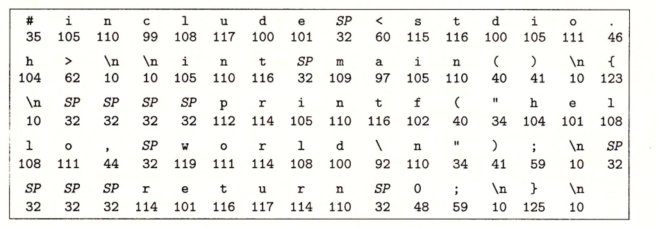

### 信息就是位+上下文

​	系统中的所有信息--包括磁盘文件、内存中的不同程序、内存中存放的用户数据以及网络上传送的数据，都是由一串***比特***表示的。

源程序是由一个由值0和1组成的位（比特）序列，8个***位（bit）***被组织成一排，称为***字节（byte）***

~~~c
#include<stdio.h>

int main() {
    printf("hello, world\n");
    return 0;
}
~~~

上述代码是以***字节序列***的方式存储在文件中的，大部分现代计算机系统都使用ASCII标准来表示文本字符。

​								上述代码的ASCII文本表示

### 程序被编译的基本过程

#### 预处理阶段：

​	将文件中引用其他文件（stdio.h）中的内容插入程序文本中，生成以**.i**结尾的文件（hello.i）

#### 编译阶段：

​	编译器将**hello.i**翻译成文本文件**hello.s**，它包含一个汇编程序

#### 汇编阶段

​	汇编器将**hello.s**翻译成机器语言指令生成**hello.o**

#### 链接阶段

​	链接器将代码中的**printf**函数从**printf.o**文件中合并到hello.o程序中，最后得到**hello**文件（可执行文件）

### 从系统的硬件组成角度看运行hello程序时发生了什么

### 存储器的层次结构

### 操作系统的核心概念：进程，线程，虚拟地址空间，文件

### 系统之间的网络通信

### 并行和并发

### 计算机系统提供的抽象。

