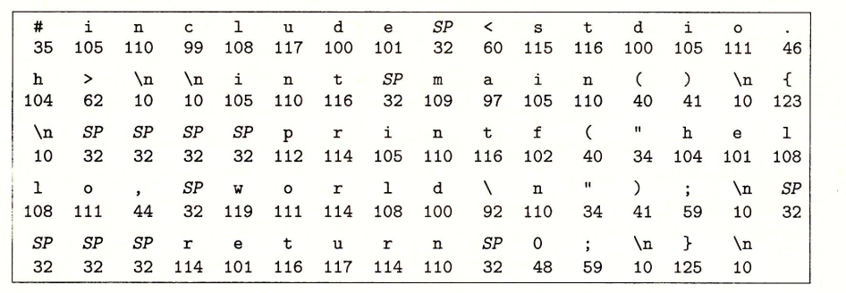
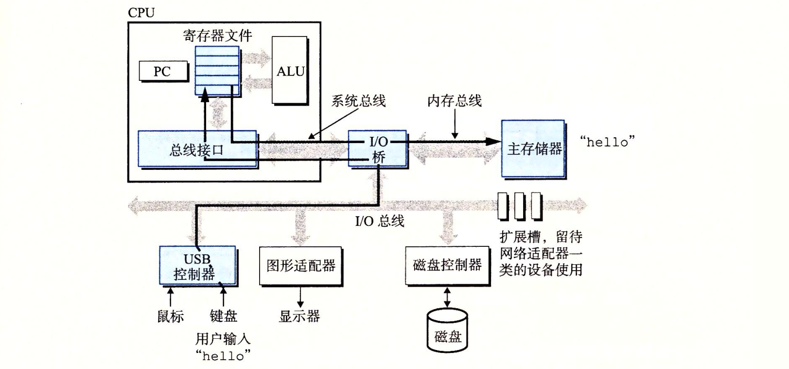
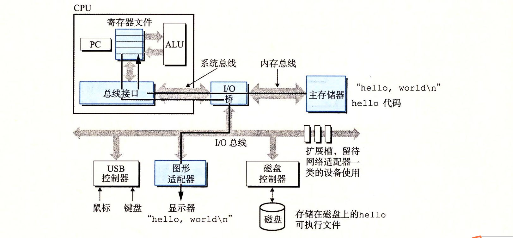
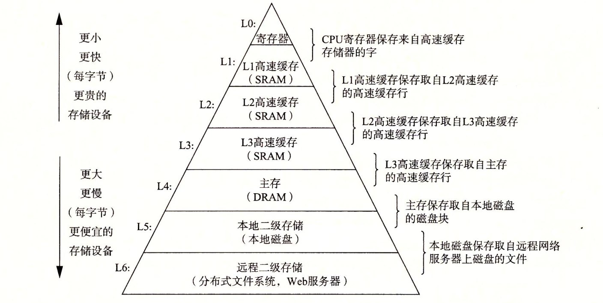
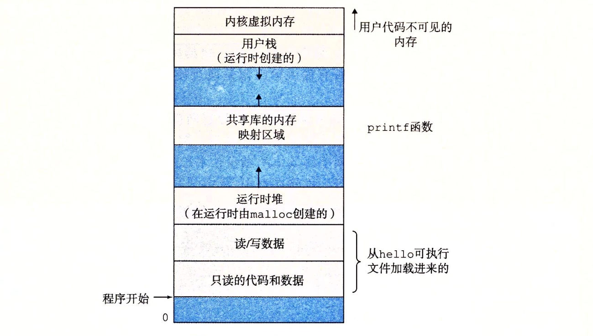
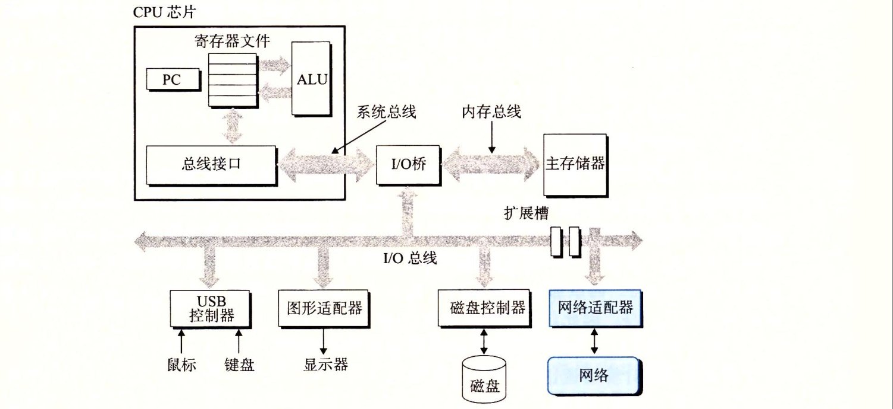

### 信息就是位+上下文

​	系统中的所有信息--包括磁盘文件、内存中的不同程序、内存中存放的用户数据以及网络上传送的数据，都是由一串***比特***表示的。

源程序是由一个由值0和1组成的位（比特）序列，8个***位（bit）***被组织成一排，称为***字节（byte）***

~~~c
#include<stdio.h>

int main() {
    printf("hello, world\n");
    return 0;
}
~~~

上述代码是以***字节序列***的方式存储在文件中的，大部分现代计算机系统都使用ASCII标准来表示文本字符。

​								上述代码的ASCII文本表示

### 程序被编译的基本过程

#### 预处理阶段：

​	将文件中引用其他文件（stdio.h）中的内容插入程序文本中，生成以**.i**结尾的文件（hello.i）

#### 编译阶段：

​	编译器将**hello.i**翻译成文本文件**hello.s**，它包含一个汇编程序

#### 汇编阶段

​	汇编器将**hello.s**翻译成机器语言指令生成**hello.o**文件

#### 链接阶段

​	链接器将代码中的**printf**函数从**printf.o**文件中合并到hello.o程序中，最后得到**hello**文件（可执行文件）

### 从系统的硬件组成角度看运行hello程序时发生了什么

​	1. 当我们在键盘上输入字符串“./hello”后，shell程序将字符逐一读入寄存器，再把它放在内存中

 2. 在键盘上敲击回车时，shell将目标文件中的代码和数据复制到主存。hello文件中的代码被加载到主存后，处理器就开始执行hello程序的main方法中的机器语言指令。这些指令将"hello, world\n"字符串中的字节从主存复制到寄存器文件，再从寄存器文件中复制到显示设备，最终显示在屏幕上。

    

### 存储器的层次结构

当CPU寄存器要访问某个数据时先从L1中查看是否有该数据，如果有则从L1中获取，如果没有则从L2中查看，以此类推。

### 操作系统的核心概念：线程，虚拟地址空间，文件

#### 进程：

​	进程是操作系统对一个正在运行的程序的一种抽象。例如：QQ就是一个进程。

​	在任何一个时刻单处理器系统都只能执行一个进程的代码。

​	

#### 线程：

​	一个进程可以由多个线程组成，每个线程都运行在进程的上下文中，共享同样的代码和数据。

#### 虚拟内存：

​	虚拟内存为每个进程提供了一个每个进程都在独占地使用主存。下图为Linux进程的虚拟地址空间。虚拟地址空间最上面的部分区域是保留给操作系统中的代码和数据的，用户程序无法访问。

#### 文件：

​	文件就是字节序列。每个I/O设备，包括磁盘、键盘、显示器、甚至网络都可以看成是文件。系统中通过使用一小组Unix I/O的系统函数调用读写文件来实现的。

### 系统之间的网络通信

​	系统可以从主存复制一串字节到网络适配器，数据流经过网络适配器到达另一台机器。同样系统可以读取从其他机器发送来的数据，并把数据复制到自己的主存。

​	例如：我们可以使用telnet应用在一个远程主机上运行hello程序

​	当我们在telnet客户端键入`hello`字符串并桥下回车，客户端软件会将这个字符串发送到telnet服务器。telnet服务器从网络上接收到这个字符串后，会把它传送给远端shell程序。接下来，远端shell运行hello程序，并将输出行返回给telnet服务器。最后，telnet服务器通过网络把输出穿转发给telnet客户端，客户端就将输出到我们本地终端上。

### 并行和并发

	#### 线程级并发

​	CPU在一个进程内的不同线程之间不停切换运行。现代处理器提供了***超线程***来提高CPU的并发能力。***超线程***是指允许一个CPU同时执行多个控制流的技术。例如：i7处理器可以让每个核执行2个线程。

#### 指令集并行

​	现代处理器可以同时执行多条指令

#### 单指令、多数据并行（SIMD并行）

​	许多现代处理器拥有特殊的硬件，允许一条指令产生多个可以并行执行的操作。

### 计算机系统提供的抽象

​	抽象是指将复杂的处理封装成一个简单地概念，使用者在使用时不需要了解内部具体是如何执行的。例如：指令集架构提供了对实际处理器硬件的抽象，使用这个抽象，机器代码程序表现得就好像运行在一个一次只执行一条指令的机器上。

​	在比如：JAVA中我们只需要通过`new`来创建一个对象，对于底层如何申请内存空间、执行什么机器指令我们并不需要关心。

### 问题：

 	1. CPU可以并行执行多线程？CPU1和CPU2可以同时执行一个进程的不同线程吗？
 	2. C程序最后会变成汇编，JAVA是否也会

